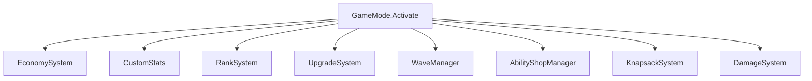
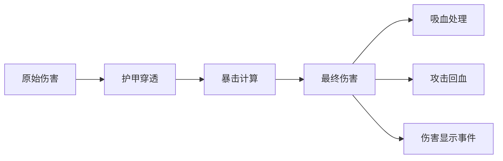

# Dota 2 自定义游戏项目架构总览

> 本文档详细介绍项目的技术架构、核心系统、数值配置和开发流程。

---

## 🏗️ 项目结构

```
d:\text_everyday\
├── game/scripts/src/          # 服务端 TypeScript 代码
│   ├── GameMode.ts            # 🎮 主入口，游戏生命周期管理
│   ├── systems/               # 核心系统模块
│   ├── mechanics/             # 游戏机制（经济系统）
│   ├── abilities/             # 技能定义
│   ├── modifiers/             # Modifier 效果
│   ├── items/                 # 物品逻辑
│   ├── config/                # 开发配置
│   ├── json/                  # JSON 数据配置
│   └── utils/                 # 工具库
├── content/panorama/src/      # 客户端 Panorama UI (React TSX)
│   └── hud/                   # 主界面组件
├── shared/                    # 前后端共享类型定义
├── excels/                    # Excel 数据表（数值配置源）
└── scripts/                   # 构建脚本
```

---

## 🎮 核心系统架构

### 1. GameMode.ts - 游戏主入口
**文件**: [GameMode.ts](file:///d:/text_everyday/game/scripts/src/GameMode.ts)

主要职责：
- **初始化所有子系统**：经济、属性、阶位、升级、波次等
- **管理游戏生命周期**：开始、重启、结束
- **注册事件监听器**：NPC出生、死亡、聊天命令
- **Filter 系统**：伤害过滤、经验过滤



---

### 2. CustomStats - 自定义属性系统
**文件**: [CustomStats.ts](file:///d:/text_everyday/game/scripts/src/systems/CustomStats.ts)

#### 核心属性 (HeroStats)
| 属性 | 中文名 | 说明 |
|------|--------|------|
| `constitution` | 根骨 | 影响生命值 |
| `martial` | 武道 | 影响攻击力 |
| `divinity` | 神念 | 影响法力值 |
| `agility` | 身法 | 影响攻速/移速 |
| `rank` | 阶位 | 0=凡胎, 1=觉醒, 2=宗师, 3=半神, 4=神话, 5=禁忌 |
| `display_level` | 显示等级 | 界面显示的等级 |
| `lifesteal` | 吸血率 | 百分比 |
| `armor_pen` | 护甲穿透 | 固定值 |
| `life_on_hit` | 击中回血 | 每次攻击回复生命 |

#### 经验公式
```typescript
// 升级所需经验
GetExpRequiredForLevel(level: number): number {
    return 100 + level * 30 + (level * level * 5);
}
```

---

### 3. RankSystem - 阶位系统
**文件**: [RankSystem.ts](file:///d:/text_everyday/game/scripts/src/systems/RankSystem.ts)

#### 阶位进阶规则
| Rank | 名称 | 等级上限 | 信仰消耗 |
|------|------|----------|----------|
| 0 | 凡胎 | 10级 | - |
| 1 | 觉醒 | 20级 | 100 |
| 2 | 宗师 | 30级 | 200 |
| 3 | 半神 | 40级 | 300 |
| 4 | 神话 | 50级 | 400 |
| 5 | 禁忌 | 50级(上限) | 500 |

```typescript
// 等级上限公式
MaxLevel = Math.min((Rank + 1) * 10, 50)

// 信仰消耗公式
FaithCost = 100 * (Rank + 1)
```

---

### 4. UpgradeSystem - 修炼商城系统
**文件**: [UpgradeSystem.ts](file:///d:/text_everyday/game/scripts/src/systems/UpgradeSystem.ts)

#### 8个境界配置
| 境界 | 价格/格 | 解锁条件 |
|------|---------|----------|
| 入门境 | 200 | Rank 0 |
| 觉醒境 | 800 | Rank 1 |
| 宗师境 | 2,500 | Rank 2 |
| 破绽境 | 6,500 | Rank 3 |
| 超凡境 | 18,000 | Rank 4 |
| 入圣境 | 50,000 | Rank 5 |
| 神座境 | 150,000 | Rank 5+ |
| 禁忌境 | 500,000 | Rank 5+ |

每个境界包含 **8个属性格子**：根骨、武道、神念、身法、攻速、吸血、破军、护穿等。

---

### 5. WaveManager - 波次管理系统
**文件**: [WaveManager.ts](file:///d:/text_everyday/game/scripts/src/systems/WaveManager.ts)

#### 时间轴配置
- **准备期**: 150秒 (2:30)
- **出怪时长**: 20秒
- **休整时间**: 70秒
- **波次间隔**: 90秒

#### 20波次配置
- 波次 1-4: 普通怪
- 波次 5: Boss波 (小怪+Boss)
- 波次 6-9: 普通怪
- 波次 10: Boss波
- 波次 11-14: 普通怪
- 波次 15: Boss波
- 波次 16-19: 普通怪
- **波次 20**: 最终Boss (Boss + 4护卫)

---

### 6. EconomySystem - 经济系统
**文件**: [EconomySystem.ts](file:///d:/text_everyday/game/scripts/src/mechanics/EconomySystem.ts)

#### 货币类型
| 货币 | 用途 |
|------|------|
| 灵石 (spirit_coin) | 购买技能、升级属性 |
| 信仰 (faith) | 阶位突破 |
| 战魂 (defender_points) | 守家积分 |

初始灵石: **200**

---

## 📊 数据配置来源

### JSON 配置 (运行时读取)
| 文件 | 用途 |
|------|------|
| [npc_heroes_custom.json](file:///d:/text_everyday/game/scripts/src/json/npc_heroes_custom.json) | 英雄属性配置 |
| [npc_units_custom.json](file:///d:/text_everyday/game/scripts/src/json/npc_units_custom.json) | 单位/怪物配置 |
| [npc_abilities_custom.json](file:///d:/text_everyday/game/scripts/src/json/npc_abilities_custom.json) | 技能配置 |
| [npc_items_custom.json](file:///d:/text_everyday/game/scripts/src/json/npc_items_custom.json) | 物品配置 |

### Excel 数据表 (数值设计源)
| 文件 | 用途 |
|------|------|
| 英雄表.xlsx | 英雄基础属性 |
| 单位表.xlsx | 怪物属性/掉落 |
| 刷怪表.xlsx | 波次刷怪配置 |
| 物品表.xlsx | 物品属性 |
| 技能表.xlsx | 技能参数 |

---

## 🎨 前端 UI 组件

### Panorama React 架构
**目录**: [content/panorama/src/hud/](file:///d:/text_everyday/content/panorama/src/hud)

| 组件 | 功能 |
|------|------|
| [HeroHUD.tsx](file:///d:/text_everyday/content/panorama/src/hud/HeroHUD.tsx) | 底部英雄信息栏 |
| [TopHUD.tsx](file:///d:/text_everyday/content/panorama/src/hud/TopHUD.tsx) | 顶部状态栏 |
| [MerchantShopPanel.tsx](file:///d:/text_everyday/content/panorama/src/hud/MerchantShopPanel.tsx) | 修炼商城界面 |
| [AbilityShopPanel.tsx](file:///d:/text_everyday/content/panorama/src/hud/AbilityShopPanel.tsx) | 技能商店界面 |
| [KnapsackPanel.tsx](file:///d:/text_everyday/content/panorama/src/hud/KnapsackPanel.tsx) | 背包界面 |

---

## 🔌 前后端通信

### 共享类型定义
**目录**: [shared/](file:///d:/text_everyday/shared)

#### 游戏事件 (gameevents.d.ts)
```typescript
// 客户端 -> 服务端
cmd_c2s_train_enter: {}           // 进入训练室
cmd_merchant_purchase: {...}       // 购买属性
cmd_attempt_rank_up: {}           // 尝试突破

// 服务端 -> 客户端
economy_update: {...}             // 经济更新
custom_stats_update: {...}        // 属性更新
wave_state_changed: {...}         // 波次状态
```

#### NetTable (net_tables.d.ts)
```typescript
economy: { spirit_coin, faith }   // 玩家经济
upgrade_system: {...}             // 商城数据
wave_state: {...}                 // 波次状态
knapsack: {...}                   // 背包数据
```

---

## 🛠️ 调试命令

在游戏内聊天框输入：

| 命令 | 功能 |
|------|------|
| `-skip` | 跳到下一波 |
| `-wave 5` | 跳转到第5波 |
| `-killall` | 杀死所有敌人 |
| `-lvlup 10` | 升10级 |
| `-gold 9999` | 添加灵石+信仰 |
| `-faith 1000` | 添加信仰 |
| `-start` | 强制开始游戏 |

---

## 🚀 开发流程

1. **启动开发服务器**: `yarn dev` (已运行)
2. **修改代码**: TypeScript 自动编译
3. **游戏内重载**: 聊天输入 `r` 或 `restart`

### 配置开发英雄
**文件**: [DevConfig.ts](file:///d:/text_everyday/game/scripts/src/config/DevConfig.ts)
```typescript
export const DEV_HERO = 'npc_dota_hero_juggernaut'; // 剑圣
// export const DEV_HERO = 'npc_dota_hero_marci';   // 玛西
```

---

## 📝 总结

这是一个**修仙/塔防**类型的 Dota 2 自定义游戏，核心玩法：
1. 玩家控制英雄在基地防守怪物波次
2. 击杀怪物获得灵石和信仰
3. 通过修炼商城购买属性提升
4. 等级满后消耗信仰进行阶位突破
5. 最终击败第20波最终Boss获胜

---

## 🔧 工具类详解

### 1. Event 事件系统
**文件**: [event.lua](file:///d:/text_everyday/game/scripts/src/utils/event.lua) + [event.d.ts](file:///d:/text_everyday/game/scripts/src/utils/event.d.ts)

功能：发布-订阅模式的事件总线，用于模块间解耦通信。

```typescript
// 注册事件监听
Event.on('怪物-死亡', (data) => {
    print(`怪物被击杀: ${data.entindex_killed}`);
});

// 发送事件
Event.send('怪物-死亡', { entindex_killed: entity.GetEntityIndex() });
```

### 2. Pool 权重池
**文件**: [pool.lua](file:///d:/text_everyday/game/scripts/src/utils/pool.lua) + [pool.d.ts](file:///d:/text_everyday/game/scripts/src/utils/pool.d.ts)

功能：权重随机抽取，适用于掉落表、抽奖。

```typescript
const pool = new Pool<string>();
pool.add('普通装备', 70);  // 70% 概率
pool.add('稀有装备', 25);  // 25% 概率
pool.add('传说装备', 5);   // 5% 概率

const item = pool.draw();  // 按权重随机抽取
```

### 3. Tween 补间动画
**文件**: [tween_lib.lua](file:///d:/text_everyday/game/scripts/src/utils/tween_lib.lua) + [tween.d.ts](file:///d:/text_everyday/game/scripts/src/utils/tween.d.ts)

功能：数值/位置平滑过渡，多种缓动函数。

---

## 🚀 增强框架详解

### CDOTA_BaseNPC 扩展方法
**文件**: [CDOTA_BaseNPC.ts](file:///d:/text_everyday/game/scripts/src/enhance/CDOTA_BaseNPC.ts)

| 方法 | 用途 | 示例 |
|------|------|------|
| `GetCustomValue(key)` | 获取自定义值 | `hero.GetCustomValue('_heroStats')` |
| `SetCustomValue(key, value)` | 设置自定义值 | `hero.SetCustomValue('rank', 1)` |
| `Mover(target, time)` | 平滑移动到目标点 | `unit.Mover(targetPos, 0.5)` |
| `Pause(time)` | 暂停单位 | `unit.Pause(2)` 定身2秒 |
| `GetMinDistanceUnit(range)` | 获取最近敌人 | `hero.GetMinDistanceUnit(600)` |
| `RoundAOE(radius, pos, callback)` | 圆形AOE | `hero.RoundAOE(300, pos, ApplyDamage)` |
| `SafetyRemoveSelf()` | 安全移除单位 | 移到场外+强杀+发送事件 |
| `RecoverBlood(value)` | 恢复生命(带特效) | `hero.RecoverBlood(100)` |
| `AddMaxBaseHealth(value)` | 增加最大生命 | `hero.AddMaxBaseHealth(500)` |
| `AddBaseDamage(value)` | 增加基础攻击 | `hero.AddBaseDamage(50)` |

### 全局工具函数
**文件**: [global.ts](file:///d:/text_everyday/game/scripts/src/enhance/global.ts)

| 函数 | 用途 |
|------|------|
| `AngleToVector(angle)` | 角度转向量 |
| `RotateVector2D(v, angle)` | 旋转2D向量 |
| `GetRotateVectors(forward, count, interval)` | 生成扇形向量组 |
| `Bezier2(points, t)` | 2阶贝塞尔曲线 |
| `Bezier3(points, t)` | 3阶贝塞尔曲线 |
| `deepClone(obj)` | 深拷贝 |
| `IsValid(handle)` | 判断handle有效性 |
| `FindNearestWalkablePoint(pos, radius)` | 查找可行走点 |
| `CreateParticleToPoint(path, attach, pos)` | 创建特效 |
| `SetPlayerSys(id, key, value)` | 设置玩家子系统 |
| `GetPlayerSys(id, key)` | 获取玩家子系统 |

---

## ⚔️ 伤害系统详解
**文件**: [DamageSystem.ts](file:///d:/text_everyday/game/scripts/src/systems/DamageSystem.ts)

### 伤害处理链



### 核心公式

| 机制 | 公式 |
|------|------|
| 护甲减伤 | `reduction = armor * 0.052 / (1 + abs(armor) * 0.052)` |
| 有效护甲 | `effectiveArmor = max(0, targetArmor - armorPen)` |
| 暴击伤害 | `damage * (critDamage / 100)` |
| 吸血回复 | `damage * lifestealPercent / 100` |

---

## 🎒 背包系统详解
**文件**: [KnapsackSystem.ts](file:///d:/text_everyday/game/scripts/src/systems/KnapsackSystem.ts)

### 存储结构

| 类型 | 容量 | 布局 |
|------|------|------|
| 公用仓库 | 16格 | 2行 × 8列 |
| 私人背包 | 40格 | 5行 × 8列 |

### 物品接口

```typescript
interface KnapsackItem {
    itemName: string;    // 物品名称
    itemId: number;      // 物品ID
    charges: number;     // 数量/层数
    stackable: boolean;  // 是否可堆叠
    icon?: string;       // 图标路径
}
```

### 支持的物品类型

| 物品ID | 名称 | 用途 |
|--------|------|------|
| 1 | 演武残卷 | 随机获得技能书 |
| 2 | 问道签 | 打开选择界面 |
| 3 | 衍法灵笺 | 变换技能 |
| 4 | 空白拓本 | 剥离技能 |
| 5-8 | 悟道石 | 强化技能 |

### 客户端事件

| 事件 | 方向 | 用途 |
|------|------|------|
| `backpack_use_item` | C→S | 使用物品 |
| `backpack_swap_item` | C→S | 交换物品 |
| `backpack_drop_item` | C→S | 丢弃物品 |
| `backpack_tidy_up` | C→S | 整理背包 |
| `backpack_decompose` | C→S | 分解物品 |
| `backpack_updated` | S→C | 背包数据更新 |

### 待优化功能

- [ ] 分解物品功能 (`DecomposeItems`)
- [ ] 合成装备功能 (`backpack_combine_equip`)
- [ ] 合成技能功能 (`backpack_combine_skill`)
